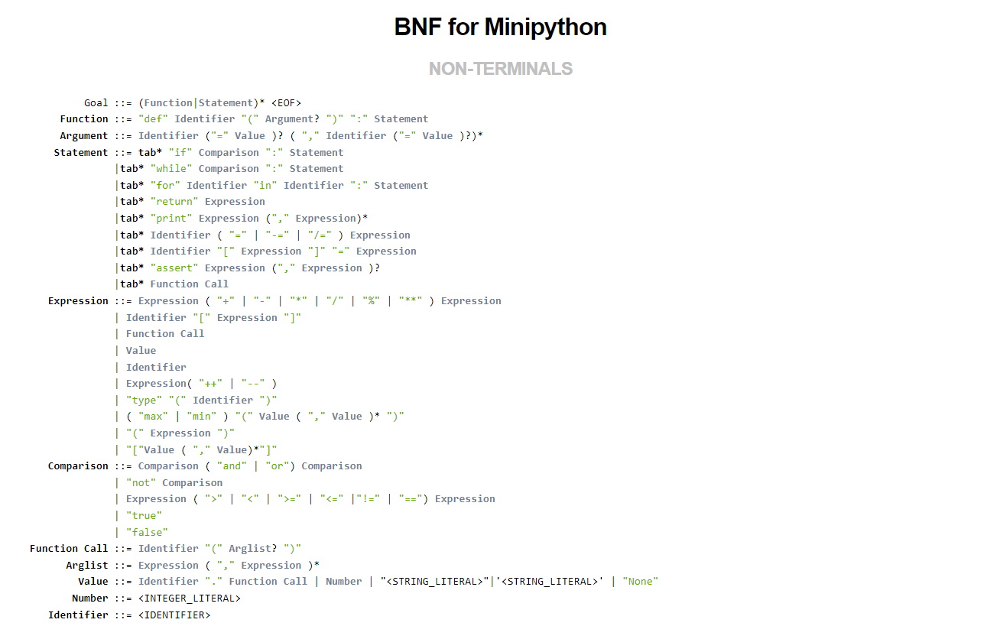

# **About this project**

> The purpose of this project is to make a compiler in Java that checks whether or not a minipython file has any lexical/syntax errors.
>   * Minipython implements the following:
>       * Assigning integers, decimals and strings.
>       * Assigning lists to variables.
>       * Declaring functions with simple arguments or with default values.
>       * If, print, while, for functions.
>       * Function calls.
>       * Single line comments.

# **Contents**
- [**About this project**](#about-this-project)
- [**Contents**](#contents)
  - [**Example of minipython code**](#example-of-minipython-code)
  - [**BNF for MiniPython**](#bnf-for-minipython)
- [**Implementation**](#implementation)
  - [**Abstract Syntax Tree**](#abstract-syntax-tree)
    - [**How to run**](#how-to-run)
  - [**Semantic Analysis**](#semantic-analysis)
    - [**How to run**](#how-to-run-1)

## **Example of minipython code**

```
#A miniPython example

def fib(n):    # write Fibonacci series up to n
               a = 0
               b = 1
               while a < n:
                        print a
                        a = b
                        b = a + b
                      
def funcwithdef(name,university="aueb"):
       print name, " studies in ", university 
```

## **BNF for MiniPython**



# **Implementation**

## **Abstract Syntax Tree**

* Creates the syntax tree of the given minipython file. You can either use [`example.py`](example.py), [`exmple1.py`](example1.py) or create your own python files and use those.

### **How to run**

* Open cmd and navigate to where your files are located. From there do the following:
    * `sablecc minipython.grammar`
    * `javac ASTTest1.java`
    * `java ASTTest1 example.py`
* The AST is printed in your terminal.

## **Semantic Analysis**

>Implements two visitors that check for the following in a given minipython file:
  
1) Use of undeclared variable. *A variable is considered declared if it is assigned a value or if it is used as an argument in a function declaration, **all variables are global**.*

```
def add(x,y):
   return x + y
print k
```

*The following code is wrong because the variable is used before declaration.*

```
def add(x,y):
   return x + y
print k
k = 0
```

2) Calling an undeclared function *(here a function can be used before the declaration)*.

3) Incorrect argument definition in function call. 

*The following code is correct.*

```
def add(x,y=2):
   return x + y
print add(1)
```

4) Using a variable of a different type *(eg Integer with String)* as an integer.

```
def add(x,y):
   return x + y
k="hello world"
print add(2,k)
```

5) Arithmetic expressions in which the following are used as operators: **None, type(variable)**

6) Incorrect way of using a function call

```
def add(x,y):
   return "hello world"
print add(2,1)+2
```

7) Function overload

*The following is wrong (Both functions need at least 2 arguments)*

```
def add(x,y):
def add(x,y,z=1)
```

*The following is wrong (Both functions need at most 3 arguments)*

```
def add(x,y,z):
def add(x,y,z=1)
```

### **How to run**

* Open cmd and navigate to where your files are located. From there do the following:
    * `sablecc minipython.grammar`
    * `javac ParserTest.java`
    * `java ParserTest example.py`
* If there are semantic errors, they will be printed in your terminal.